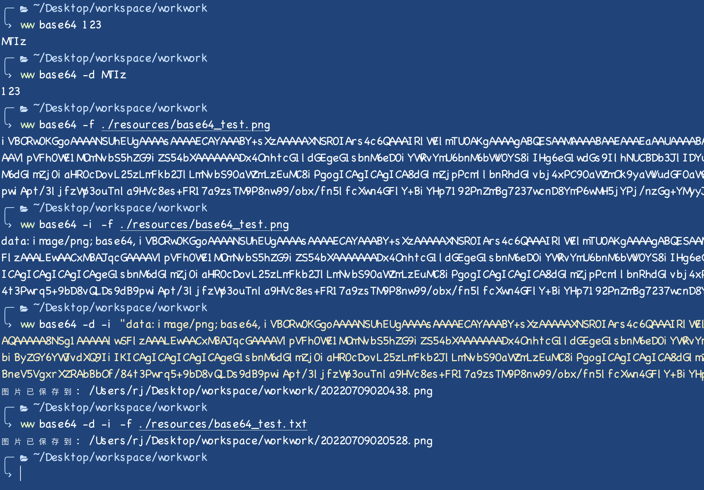
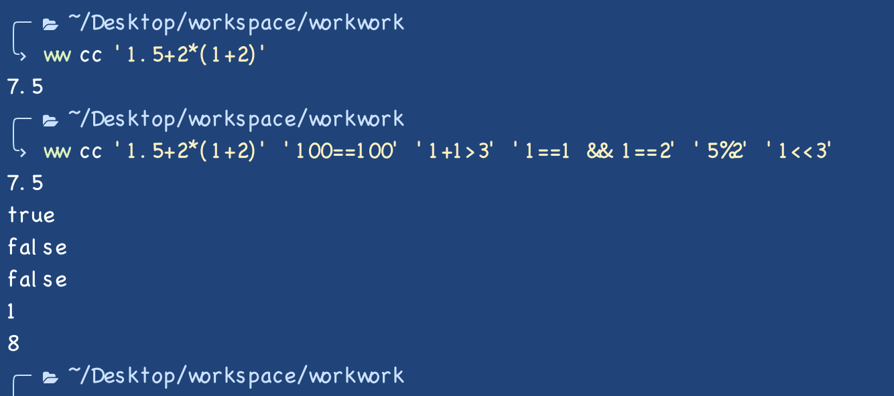
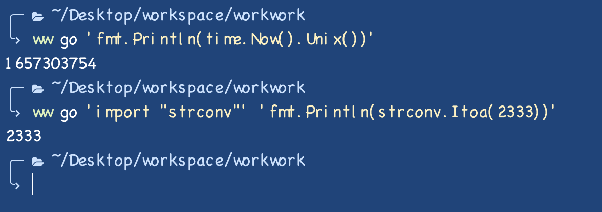
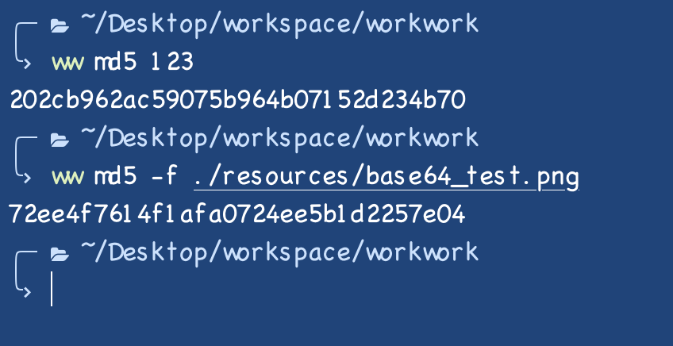
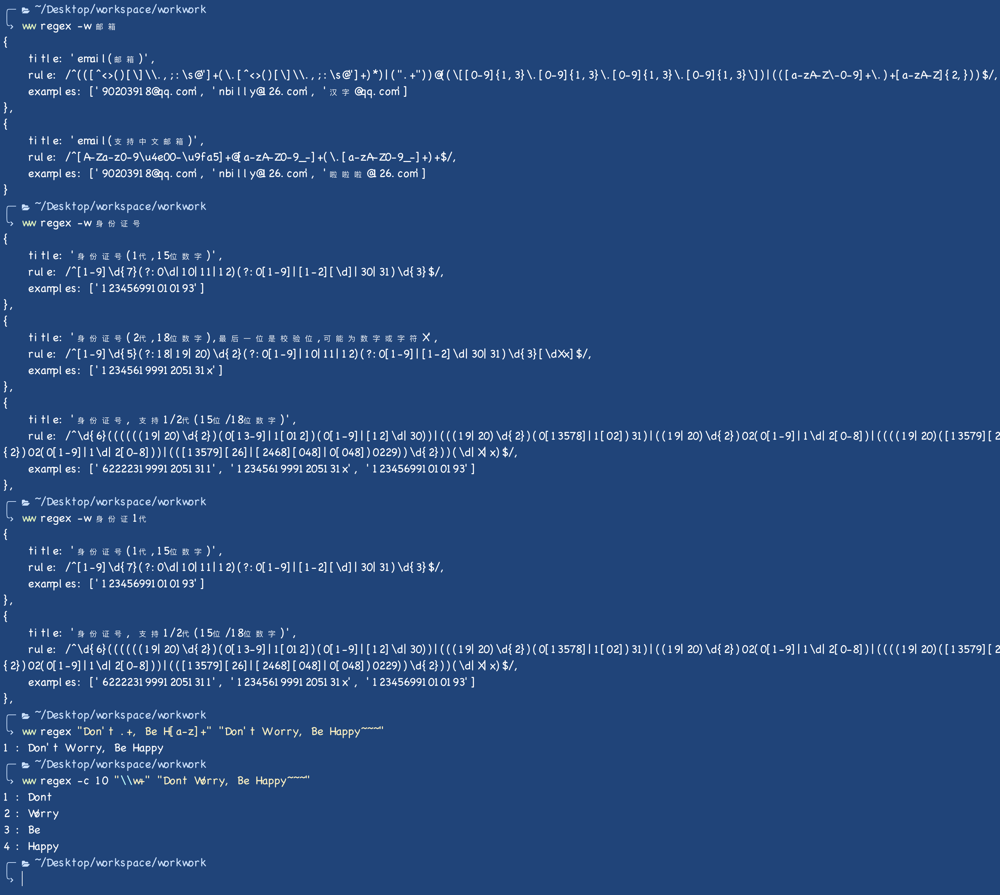
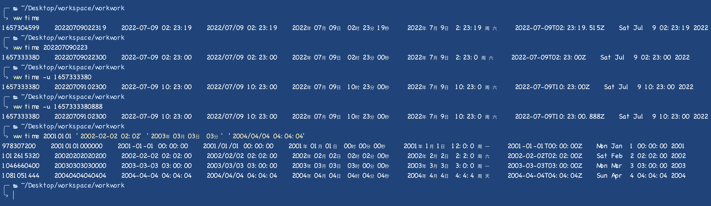
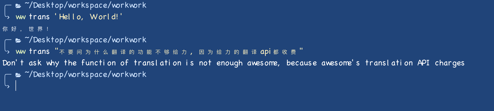
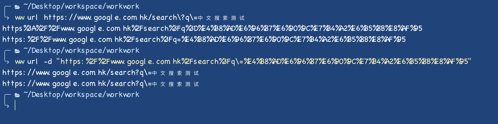
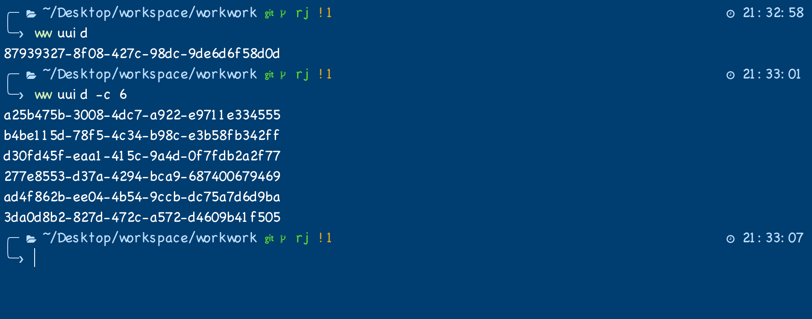

# workwork
Developer/Tester common tools CLI. <br>开发/测试常用工具CLI

> [Base64 encode/decode. <br>Base64编码/解码](#base64)

> [Calculater<br>计算器](#cc)

> [Run Go scripts by string.<br>使用字符串, 像脚本一样直接运行Go代码](#go)

> [md5](#md5)

> [Regex test tool.<br>正则表达式测试工具](#regex)

> [Time format tool.<br>时间转换工具](#time)

> [Chinese/English Translate tool.<br>汉英/英汉翻译](#trans)

> [URL encode/decode.<br>URL编码/解码](#url)

> [uuid](#uuid)
# Install
### Mac
```shell
brew install shenguanjiejie/tap/workwork
```
or
```shell
wget https://github.com/shenguanjiejie/workwork/releases/download/v1.0.1/workwork_1.0.1_darwin.tar.gz && tar -zxvf ./workwork_1.0.1_darwin.tar.gz && mv ./ww /usr/local/bin && rm ./workwork_1.0.1_darwin.tar.gz && rm ./ww
```
or<br><br>[Download](https://github.com/shenguanjiejie/workwork/releases), Unpack, and move "ww" to /usr/local/bin.<br>到[release页面](https://github.com/shenguanjiejie/workwork/releases)下载后, 解压出ww文件, 放在/usr/local/bin目录下即可
### Linux
```shell
wget https://github.com/shenguanjiejie/workwork/releases/download/v1.0.1/workwork_1.0.1_linux_x86_64.tar.gz && tar -zxvf ./workwork_1.0.1_linux_x86_64.tar.gz && mv ./ww /usr/local/bin && rm ./workwork_1.0.1_linux_x86_64.tar.gz && rm ./ww
```
or<br><br>[Download](https://github.com/shenguanjiejie/workwork/releases), Unpack, and move "ww" to /usr/local/bin.<br>到[release页面](https://github.com/shenguanjiejie/workwork/releases)下载后, 解压出ww文件, 放在/usr/local/bin目录下即可
# base64
Base64 encode/decode. <br>Base64编码/解码<br>Multiple encode/decode support, split with space.<br>支持用空格隔开, 一次进行多个编码/解码

|params(参数)|shorthand(缩写)|default(默认值)|usage(说明)|
|---|---|---|---|
|--file|-f||Specify full file path.<br>指定文件的全路径|
|--decode|-d|false|Decode flag. <br>是否是要解码|
|--image|-i|false|Image flag will append "data:image/png;base64," to header of decode result, and save image to current path after encode.<br>是否是对图片的编解码, 对图片编码会增加"data:image/png;base64,"前缀, 对base64进行图片解码会保存png文件到当前目录|


# cc
Calculater<br>计算器<br>Based on Go interpreter, supports various operators, logical operations, and bitwise operations. <br>使用Go解释器实现,支持各种运算符,逻辑运算以及位运算


# go
Run Go scripts by string.<br>使用字符串, 像脚本一样直接运行Go代码<br>"fmt" "time" "os" "math" is imported by default,otherwise you should import packages by yourself.<br>fmt,time,os,math包默认引入, 其他包需单独import


# md5
md5<br>Multiple encode support, split with space. and file supported too.<br>支持用空格隔开,传入多个字符串md5,支持文件md5

|params(参数)|shorthand(缩写)|default(默认值)|usage(说明)|
|---|---|---|---|
|--file|-f||Specify full file path.<br>指定文件的全路径|


# regex
Regex test tool.<br>正则表达式测试工具
Source: [https://github.com/any86/any-rule](https://github.com/any86/any-rule)

|params(参数)|shorthand(缩写)|default(默认值)|usage(说明)|
|---|---|---|---|
|--file|-f||Specify full file path.<br>指定文件的全路径|
|--wanna|-w||Find common regex. <br>查找常用的正则表达式|
|--match|-m|false|Return true or false by match result. <br>能否找到正则匹配的项, 返回true或者false|
|--count|-c|1|Specify the maximum number of matches. return the first one by default.<br> 使用查找匹配文本内容时, 用该int值指定返回的最大匹配数量, 默认只返回第一个匹配项|


# time
Time format tool.<br>时间转换工具<br>Multiple support, split with space.<br>支持用空格隔开, 一次进行多个时间转换

|params(参数)|shorthand(缩写)|default(默认值)|usage(说明)|
|---|---|---|---|
|--unix|-u|false|Input a Unix time or millisecond Unix time. <br>指定时间戳, 支持秒级和毫秒级时间戳|


# trans
Chinese/English Translate tool.<br>汉英/英汉翻译<br>更详细的单词释义音标等, 后续考虑加入


# url
URL encode/decode.<br>URL编码/解码

|params(参数)|shorthand(缩写)|default(默认值)|usage(说明)|
|---|---|---|---|
|--decode|-d|false|Decode flag. <br>是否是要解码|


# uuid
uuid<br>Multiple support<br>支持输出多个uuid

|params(参数)|shorthand(缩写)|default(默认值)|usage(说明)|
|---|---|---|---|
|--count|-c|1|UUID count.<br> UUID 个数|
|--version|-v|4|UUID version, default: 4.<br> UUID 版本, 默认: 4|



# TODO:
1. 默认保存路径配置, 默认读取文件路径配置. (Default I/O path config)
2. 单元测试. (Unit testing)
3. Alfred支持. (Alfred support)
4. color command, 色值转换(类似"time")
5. ...
